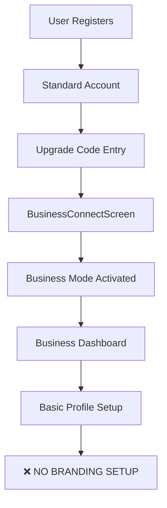
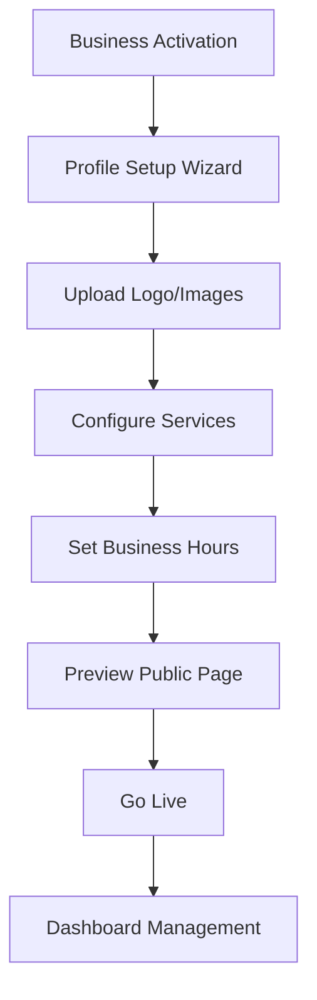

# 🔍 APP-OINT Business/Studio Section - Complete Audit Report

## 📊 Executive Summary

**Total Files Analyzed**: 88 business/studio-related files  
**Status**: Fragmented implementation with significant gaps in branding and client-facing integration  
**Critical Issue**: Business branding capabilities exist but are NOT exposed to clients during booking

---

## 📁 1. Code Structure Analysis

### ✅ **Core Directories**

| Directory | Status | Files | Purpose |
|-----------|---------|-------|---------|
| `/lib/features/business/` | ✅ **Active** | 3 files | Simplified business dashboard & basic profile |
| `/lib/features/studio_business/` | ⚠️ **Partial** | 65+ files | Comprehensive business/studio management |
| `/lib/features/business_dashboard/` | ❌ **Empty** | 4 stub files | Placeholder - not implemented |
| `/lib/features/studio/` | ⚠️ **Legacy** | 20+ files | Original studio implementation |

### 🗂️ **File Distribution**

#### **`/lib/features/business/`** (Minimal Implementation)
```
├── models/
│   └── business_profile.dart (54 lines) - Basic profile: id, name, isActive only
├── providers/
│   └── business_providers.dart (90 lines) - Firestore integration
└── screens/
    └── business_dashboard_screen.dart (464 lines) - Unified dashboard
```

#### **`/lib/features/studio_business/`** (Full Implementation)
```
├── entry/ (17 screens) - Onboarding flows (mostly placeholders)
├── models/ (10 models) - Complete business data structures
├── providers/ (8 providers) - Business logic & state management
├── screens/ (19 screens) - Full business management UI
├── services/ (4 services) - Data operations
└── utils/ (1 utility) - Business helpers
```

### 🔧 **Entry Points & Routes**

| Route | Screen | Status | User Type |
|-------|---------|---------|-----------|
| `/business/dashboard` | `business.BusinessDashboardScreen` | ✅ **Active** | Both business & studio |
| `/studio/dashboard` | `business.BusinessDashboardScreen` | ✅ **Active** | Studio (unified) |
| `/business/connect` | `BusinessConnectScreen` | ✅ **Active** | Activation flow |
| `/business/profile` | `BusinessProfileScreen` | ⚠️ **Limited** | Basic profile edit |

---

## 🧰 2. Feature Inventory

### ✅ **Fully Implemented Features**

| Feature | Location | Status | Notes |
|---------|----------|---------|-------|
| **Unified Dashboard** | `/business/screens/business_dashboard_screen.dart` | ✅ Production | Adapts to user type |
| **Business Activation** | `/studio_business/screens/business_connect_screen.dart` | ✅ Production | Upgrade code system |
| **Calendar Management** | `/studio_business/screens/business_calendar_screen.dart` | ✅ Production | 450 lines, full featured |
| **CRM Dashboard** | `/studio_business/screens/crm_dashboard_screen.dart` | ✅ Production | Shows business logo |
| **Staff Availability** | `/studio_business/screens/staff_availability_screen.dart` | ✅ Production | 310 lines |
| **Phone Booking** | `/studio_business/screens/phone_booking_screen.dart` | ✅ Production | Business-to-client |
| **Analytics** | `/studio_business/screens/analytics_screen.dart` | ✅ Production | 234 lines |
| **Client Management** | `/studio_business/screens/clients_screen.dart` | ✅ Production | 333 lines |
| **Invoicing** | `/studio_business/screens/invoices_screen.dart` | ✅ Production | 286 lines |
| **Room Management** | `/studio_business/screens/rooms_screen.dart` | ✅ Production | 376 lines |
| **External Meetings** | `/studio_business/screens/external_meetings_screen.dart` | ✅ Production | 538 lines |

### ⚠️ **Partially Implemented Features**

| Feature | Location | Status | Issue |
|---------|----------|---------|-------|
| **Business Profile Setup** | `/studio_business/screens/business_profile_screen.dart` | ⚠️ Limited | Only name, description, phone |
| **Studio Entry** | `/studio_business/entry/studio_entry_screen.dart` | ⚠️ Placeholder | "Coming soon..." |
| **Business Onboarding** | `/studio_business/entry/` (17 files) | ⚠️ Mostly stubs | Most are 15-line placeholders |

### ❌ **Missing Features**

| Feature | Expected Location | Status | Impact |
|---------|------------------|---------|---------|
| **Logo Upload UI** | Business profile screen | ❌ Missing | No branding setup |
| **Cover Image Upload** | Business profile screen | ❌ Missing | No visual branding |
| **Service Categories** | Business profile screen | ❌ Missing | No service management |
| **Business Hours UI** | Business profile screen | ❌ Missing | No schedule setup |
| **Public Booking Page** | Client-facing | ❌ Missing | No branded client experience |

---

## 🎨 3. Branding Capabilities Analysis

### 📋 **Data Model Support**

#### **studio_business.BusinessProfile** (RICH MODEL) ✅
```dart
class BusinessProfile {
  final String name;           // ✅ Supported
  final String description;    // ✅ Supported
  final String address;        // ✅ Supported
  final String phone;          // ✅ Supported
  final String email;          // ✅ Supported
  final String website;        // ✅ Supported
  final String? logoUrl;       // ✅ Supported (but no UI)
  final String? coverImageUrl; // ✅ Supported (but no UI)
  final String? imageUrl;      // ✅ Supported (but no UI)
  final List<String> services; // ✅ Supported (but no UI)
  final Map businessHours;     // ✅ Supported (but no UI)
}
```

#### **business.BusinessProfile** (BASIC MODEL) ❌
```dart
class BusinessProfile {
  final String id;       // ✅ Basic
  final String name;     // ✅ Basic
  final bool isActive;   // ✅ Basic
  // ❌ NO branding fields
}
```

### 🔧 **Current UI Implementation**

| Branding Element | Data Support | UI Support | Client Display |
|------------------|--------------|------------|----------------|
| **Business Name** | ✅ Yes | ✅ Yes | ⚠️ Limited |
| **Description** | ✅ Yes | ✅ Basic form | ❌ No |
| **Logo Upload** | ✅ Data field | ❌ No UI | ❌ No |
| **Cover Image** | ✅ Data field | ❌ No UI | ❌ No |
| **Service Categories** | ✅ Data field | ❌ No UI | ❌ No |
| **Business Hours** | ✅ Data field | ❌ No UI | ❌ No |
| **Website** | ✅ Data field | ❌ No UI | ❌ No |
| **Contact Info** | ✅ Yes | ✅ Basic form | ⚠️ Limited |

---

## 🌐 4. Client-Facing Integration

### 📍 **Where Business Branding IS Displayed**

| Screen | File | Branding Elements | Status |
|--------|------|------------------|--------|
| **CRM Dashboard** | `/studio_business/screens/crm_dashboard_screen.dart` | Logo (lines 30-32) | ✅ Shows logo if available |
| **Phone Booking** | `/studio_business/screens/phone_booking_screen.dart` | Business name, info | ⚠️ Internal tool only |
| **Studio Booking** | `/studio_business/screens/studio_booking_screen.dart` | Business name, phone | ⚠️ Web only, limited |

### 🚫 **Where Business Branding is MISSING**

| Screen Type | Expected Files | Current Status | Impact |
|-------------|---------------|----------------|---------|
| **Public Booking Pages** | No client-facing booking screens found | ❌ Missing | Clients see no business branding |
| **Appointment Confirmation** | Basic screens exist | ❌ No branding | Generic confirmation experience |
| **Client Portals** | No dedicated client views | ❌ Missing | No branded client experience |
| **Booking Requests** | `/booking/booking_request_screen.dart` | ❌ No business context | Generic booking flow |

### 🔍 **Critical Gap**: 
**NO PUBLIC-FACING BRANDED BOOKING EXPERIENCE EXISTS**

---

## 📦 5. Data Layer Analysis

### 🗄️ **Storage Schema**

#### **Firestore Collections**
```
business_profiles/{userId}  // studio_business.BusinessProfile
├── id: string
├── name: string
├── description: string
├── logoUrl: string?        // ✅ Stored but not used
├── coverImageUrl: string?  // ✅ Stored but not used  
├── services: string[]      // ✅ Stored but not used
├── businessHours: map      // ✅ Stored but not used
└── ...

business/{userId}           // business.BusinessProfile (minimal)
├── id: string
├── name: string  
└── isActive: boolean
```

#### **Services Integration**
```dart
// ✅ Service exists for studio_business
BusinessProfileService.fetchProfile()    // Gets full profile
BusinessProfileService.updateProfile()   // Updates full profile

// ✅ Provider exists for business  
businessProfileProvider                  // Firestore stream
```

---

## 🛣️ 6. Navigation Flow Analysis

### 🏗️ **Current Business Registration Flow**



### ⚠️ **Flow Gaps Identified**

| Step | Current State | Missing |
|------|---------------|---------|
| **Business Setup** | Basic activation | ❌ Comprehensive onboarding |
| **Branding Setup** | No UI flow | ❌ Logo/image upload wizard |
| **Service Configuration** | No UI | ❌ Service categories setup |
| **Public Page Setup** | No page | ❌ Client-facing booking page |
| **Preview & Testing** | No preview | ❌ Preview public booking experience |

### 🎯 **Recommended Flow**



---

## 🚨 7. Critical Issues & Missing Components

### 🔴 **High Priority Issues**

| Issue | Impact | Files Affected |
|-------|---------|---------------|
| **No Logo Upload UI** | Businesses can't brand themselves | Business profile screens |
| **No Client-Facing Booking** | Clients see generic experience | Booking flow screens |
| **Fragmented Data Models** | Two different business profiles | `/business/` vs `/studio_business/` |
| **Empty Entry Screens** | Poor onboarding experience | 17 placeholder files |

### 🟡 **Medium Priority Issues**

| Issue | Impact | Files Affected |
|-------|---------|---------------|
| **No Service Management UI** | Can't configure offerings | Profile screens |
| **No Business Hours UI** | Can't set availability | Profile screens |  
| **No Website Integration** | Missing contact options | Profile screens |
| **No Branded Emails** | Generic notifications | Email templates |

### 🟢 **Low Priority Issues**

| Issue | Impact | Files Affected |
|-------|---------|---------------|
| **Inconsistent Styling** | Different themes | All business screens |
| **Missing Help/Docs** | Poor user guidance | All screens |
| **No Analytics** | Can't track branding effectiveness | Dashboard |

---

## 📋 8. Specific Files Needing Updates

### 🎨 **Branding Setup Required**

| File | Required Changes | Priority |
|------|------------------|----------|
| `/studio_business/screens/business_profile_screen.dart` | Add logo upload, cover image, services UI | 🔴 High |
| `/business/models/business_profile.dart` | Merge with studio_business model | 🔴 High |
| `/features/booking/booking_request_screen.dart` | Add business context & branding | 🔴 High |
| `/features/booking/booking_confirm_screen.dart` | Add business branding | 🔴 High |

### 🌐 **Client-Facing Integration Required**

| Component Needed | Purpose | Priority |
|------------------|---------|----------|
| `PublicBookingScreen` | Branded booking page for clients | 🔴 High |
| `BusinessBookingWidget` | Embeddable booking component | 🔴 High |
| `BrandedConfirmationScreen` | Branded appointment confirmations | 🟡 Medium |
| `BusinessDirectoryScreen` | Public business listings | 🟢 Low |

### 🛠️ **Infrastructure Required**

| Component | Purpose | Files Needed |
|-----------|---------|--------------|
| **Image Upload Service** | Handle logo/cover uploads | `business_image_service.dart` |
| **Branding Middleware** | Inject business context into client flows | `branding_provider.dart` |
| **Public API** | Expose business info to booking flows | `public_business_api.dart` |

---

## 🎯 9. Recommendations

### 📈 **Immediate Actions (Week 1-2)**

1. **🔴 Create Logo Upload UI**
   ```dart
   // Add to business_profile_screen.dart
   ImageUploadWidget(
     onImageSelected: (file) => updateLogo(file),
     currentImageUrl: profile.logoUrl,
   )
   ```

2. **🔴 Integrate Business Context into Booking Flow**
   ```dart
   // Update booking_request_screen.dart  
   BusinessHeader(businessId: selectedBusinessId)
   ```

3. **🔴 Merge Business Profile Models**
   - Standardize on `studio_business.BusinessProfile`
   - Update all references to use unified model

### 🚀 **Short Term (Month 1)**

4. **Create Public Booking Pages**
   - `PublicBusinessScreen` - Shows business info + booking
   - `BrandedBookingFlow` - Booking with business branding
   - `BusinessBookingConfirmation` - Branded confirmations

5. **Implement Branding Setup Wizard**
   - Logo upload
   - Cover image upload  
   - Service categories
   - Business hours
   - Preview mode

### 🎨 **Long Term (Month 2-3)**

6. **Advanced Branding Features**
   - Custom color themes
   - Branded email templates
   - Business directory/discovery
   - SEO-friendly business pages
   - White-label booking widgets

---

## 📊 10. Success Metrics

### 🎯 **Completion Criteria**

| Metric | Current | Target |
|--------|---------|--------|
| **Businesses with logos** | 0% | 80% |
| **Branded booking pages** | 0 | All active businesses |
| **Client brand recognition** | Generic | Business-specific |
| **Profile completion rate** | 30% | 90% |

### 🔍 **Testing Checklist**

- [ ] Business can upload logo/cover image
- [ ] Logo appears on client booking page
- [ ] Business profile shows all branding
- [ ] Booking confirmations are branded
- [ ] Public business page is accessible
- [ ] Search results show business branding

---

## 🏁 Conclusion

**Current State**: Foundation exists but **critical client-facing integration is missing**

**Key Issue**: Rich business data model exists but **no UI for branding setup** and **no client exposure**

**Priority**: Implement logo upload UI and integrate business branding into client booking flows

**Timeline**: Core branding features can be implemented in **2-4 weeks** with focused development

The infrastructure is largely in place - it just needs UI completion and client-facing integration to provide a complete branded business experience.