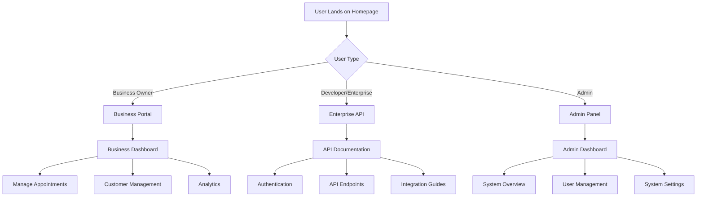
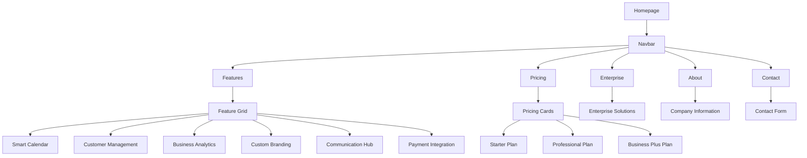
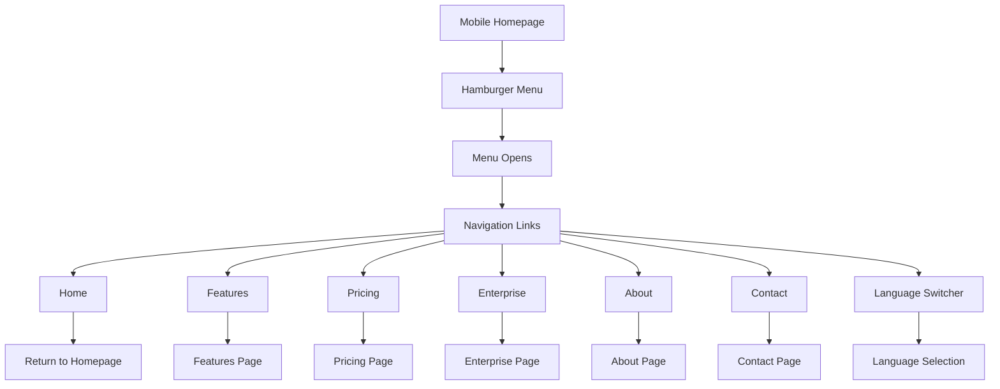
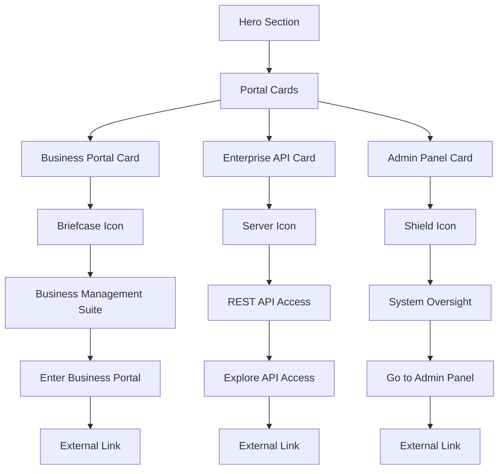
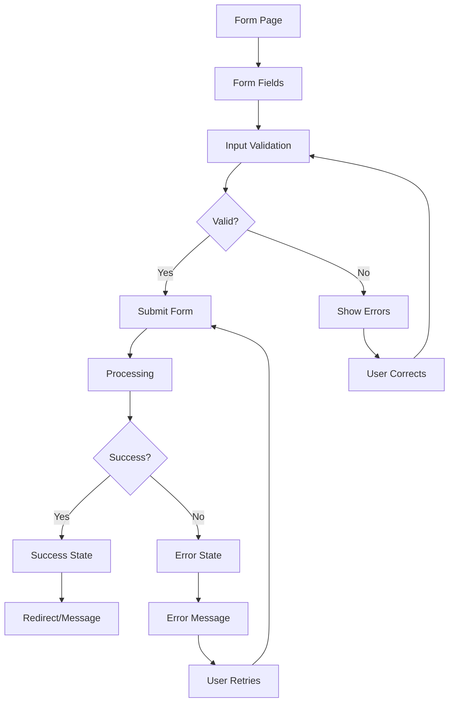
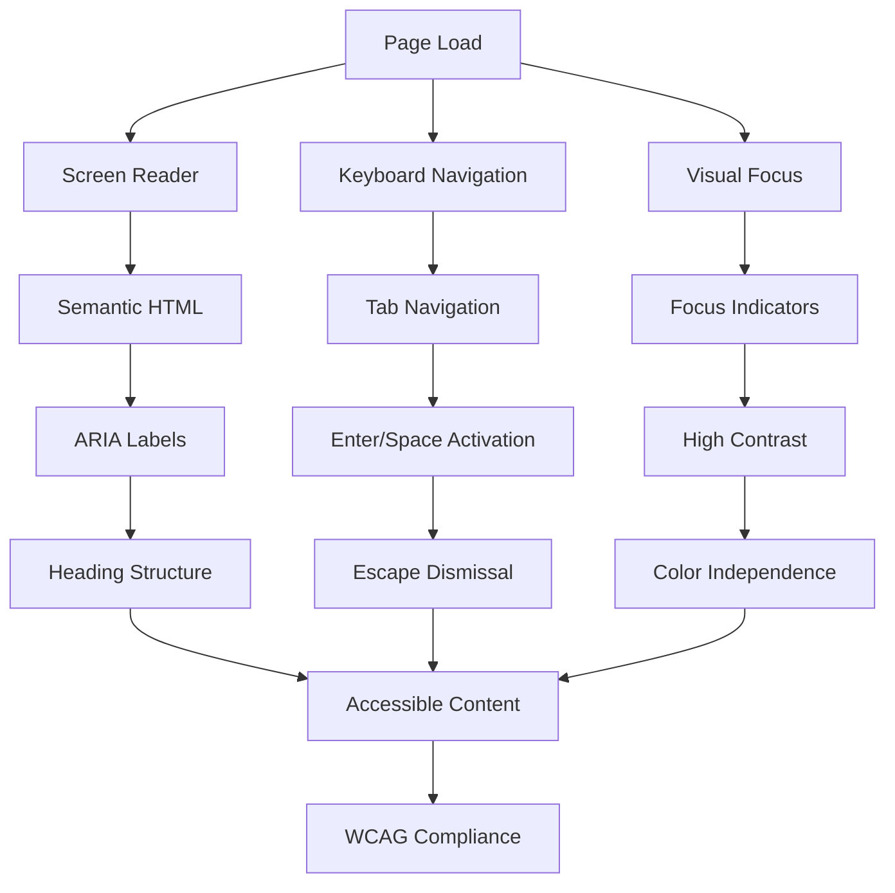

# User Flow Diagrams

## Main User Journey

```mermaid
flowchart TD
    A[User Lands on Homepage] --> B{User Type}
    
    B -->|Business Owner| C[Business Portal]
    B -->|Developer/Enterprise| D[Enterprise API]
    B -->|Admin| E[Admin Panel]
    
    C --> F[Business Dashboard]
    D --> G[API Documentation]
    E --> H[Admin Dashboard]
    
    F --> I[Manage Appointments]
    F --> J[Customer Management]
    F --> K[Analytics]
    
    G --> L[Authentication]
    G --> M[API Endpoints]
    G --> N[Integration Guides]
    
    H --> O[System Overview]
    H --> P[User Management]
    H --> Q[System Settings]
```

## Navigation Flow

```mermaid
flowchart TD
    A[Homepage] --> B[Navbar]
    B --> C[Features]
    B --> D[Pricing]
    B --> E[Enterprise]
    B --> F[About]
    B --> G[Contact]
    
    C --> H[Feature Grid]
    H --> I[Smart Calendar]
    H --> J[Customer Management]
    H --> K[Business Analytics]
    H --> L[Custom Branding]
    H --> M[Communication Hub]
    H --> N[Payment Integration]
    
    D --> O[Pricing Cards]
    O --> P[Starter Plan]
    O --> Q[Professional Plan]
    O --> R[Business Plus Plan]
    
    E --> S[Enterprise Solutions]
    F --> T[Company Information]
    G --> U[Contact Form]
```

## Mobile Navigation Flow

```mermaid
flowchart TD
    A[Mobile Homepage] --> B[Hamburger Menu]
    B --> C[Menu Opens]
    C --> D[Navigation Links]
    D --> E[Home]
    D --> F[Features]
    D --> G[Pricing]
    D --> H[Enterprise]
    D --> I[About]
    D --> J[Contact]
    D --> K[Language Switcher]
    
    E --> L[Return to Homepage]
    F --> M[Features Page]
    G --> N[Pricing Page]
    H --> O[Enterprise Page]
    I --> P[About Page]
    J --> Q[Contact Page]
    K --> R[Language Selection]
```

## Portal Selection Flow

```mermaid
flowchart TD
    A[Hero Section] --> B[Portal Cards]
    B --> C[Business Portal Card]
    B --> D[Enterprise API Card]
    B --> E[Admin Panel Card]
    
    C --> F[Briefcase Icon]
    F --> G[Business Management Suite]
    G --> H[Enter Business Portal]
    H --> I[External Link]
    
    D --> J[Server Icon]
    J --> K[REST API Access]
    K --> L[Explore API Access]
    L --> M[External Link]
    
    E --> N[Shield Icon]
    N --> O[System Oversight]
    O --> P[Go to Admin Panel]
    P --> Q[External Link]
```

## Form Interaction Flow

```mermaid
flowchart TD
    A[Form Page] --> B[Form Fields]
    B --> C[Input Validation]
    C --> D{Valid?}
    
    D -->|Yes| E[Submit Form]
    D -->|No| F[Show Errors]
    
    F --> G[User Corrects]
    G --> C
    
    E --> H[Processing]
    H --> I{Success?}
    
    I -->|Yes| J[Success State]
    I -->|No| K[Error State]
    
    J --> L[Redirect/Message]
    K --> M[Error Message]
    M --> N[User Retries]
    N --> E
```

## Accessibility Flow

```mermaid
flowchart TD
    A[Page Load] --> B[Screen Reader]
    A --> C[Keyboard Navigation]
    A --> D[Visual Focus]
    
    B --> E[Semantic HTML]
    E --> F[ARIA Labels]
    F --> G[Heading Structure]
    
    C --> H[Tab Navigation]
    H --> I[Enter/Space Activation]
    I --> J[Escape Dismissal]
    
    D --> K[Focus Indicators]
    K --> L[High Contrast]
    L --> M[Color Independence]
    
    G --> N[Accessible Content]
    J --> N
    M --> N
    N --> O[WCAG Compliance]
```
