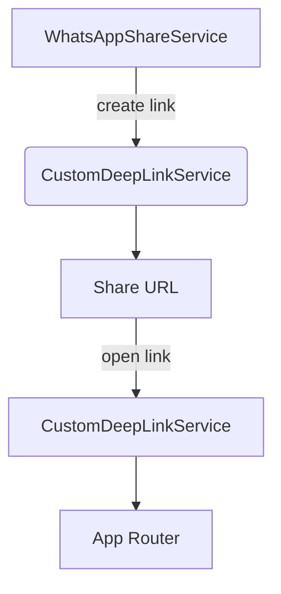

# Deep Linking Module

## Architecture Overview

The deep linking system centers around `CustomDeepLinkService` and works with
`WhatsAppShareService` to create and handle links. The service listens to
incoming URI events via `uni_links` and can navigate the user to the correct
screen. Links are generated with custom parameters so that analytics are stored
when a link is shared or opened.



1. `WhatsAppShareService` requests a meeting link from
   `CustomDeepLinkService`.
2. The link is included in a WhatsApp message and logged for analytics.
3. When the link is opened, `CustomDeepLinkService` parses the URI and (when the
   code is enabled) navigates via the provided `NavigatorState`.

## Key Classes and Responsibilities

### `CustomDeepLinkService`
- **initialize()** – sets up listeners for initial and ongoing URI events.
- **setNavigatorKey()** – supplies the navigator used for routing.
- **createMeetingLink()** – builds a URL with meeting, creator and optional
  group or context identifiers.
- **createShortLink()** – stub for connecting a URL shortener.
- **dispose()** – cleans up stream subscriptions.

### `WhatsAppShareService`
- **generateSmartShareLink()** – obtains a meeting link and stores share
  analytics.
- **shareToWhatsApp()** – launches WhatsApp or falls back to general sharing.
- **handleDeepLink()** – processes opened links and logs analytics.
- **logShareAnalytics()** – records share events in Firestore.

The data models used for analytics (`SmartShareLink`, `GroupRecognition` and
`ShareAnalytics`) live in `lib/models/smart_share_link.dart`.

## Extending or Debugging

Generate a link and share it:

```dart
final deepLinkService = CustomDeepLinkService();
final shareService = WhatsAppShareService(deepLinkService: deepLinkService);

final url = await deepLinkService.createMeetingLink(
  meetingId: '123',
  creatorId: 'abc',
);
await shareService.shareToWhatsApp(
  meetingId: '123',
  creatorId: 'abc',
  customMessage: 'Join me!',
);
```

To debug incoming links, temporarily uncomment the logic in
`_handleDeepLink` inside `CustomDeepLinkService` and watch the console for the
"Handling deep link" output.

