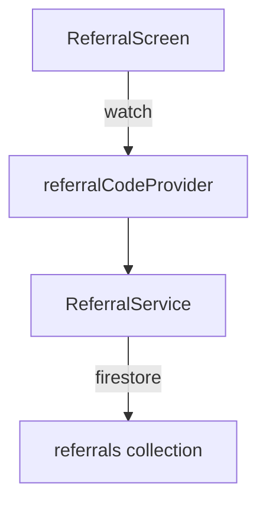

# Referral Module

## Architecture Overview

Referral codes allow users to invite others and gain rewards. Codes are stored in
Firestore and surfaced through a Riverpod provider so widgets can easily display
or copy them. The flow is:



1. `ReferralScreen` watches `referralCodeProvider`.
2. The provider uses `ReferralService` to fetch or generate a code for the
   current user.
3. `ReferralService` saves codes to the Firestore `referrals` collection and
   ensures uniqueness.

## Key Classes and Responsibilities

### `ReferralService`
- **generateReferralCode()** – creates a unique 8-character code for a given
  user. Existing codes are reused if they already exist.
- **generateReferralCodeForCurrentUser()** – helper that uses the current
  Firebase user.

### Providers
- **referralServiceProvider** – exposes a `ReferralService` instance.
- **referralCodeProvider** – async provider that returns the user’s code,
  throwing if the user is not logged in.

### UI
- **ReferralScreen** – simple page that shows the code and lets the user copy it
  to the clipboard.

## Extending or Debugging

Generate a referral code manually:

```dart
final service = ReferralService();
final code = await service.generateReferralCode('USER_ID');
print('New code: $code');
```

If codes appear duplicated, ensure the `referrals` collection has a unique index
on the `code` field and step through `generateReferralCode` with a debugger to
inspect the Firestore queries.

