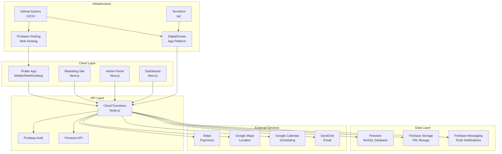

# App-Oint Repository Architecture Audit Report

## Executive Summary

**Project**: App-Oint - Flutter-based appointment booking application  
**Repository**: https://github.com/gabriellagziel/appoint  
**Primary Technology Stack**: Flutter/Dart, Firebase, Node.js  
**Deployment Platforms**: DigitalOcean App Platform, Firebase Hosting  
**Current Status**: Production-ready with 100% critical language coverage  

## 1. Top-Level Directory Structure & Components

### Core Application (Flutter)
```
/
├── lib/                     # Main Flutter application source
├── android/                 # Android platform-specific code
├── ios/                     # iOS platform-specific code  
├── web/                     # Web platform-specific files
├── windows/                 # Windows desktop support
├── linux/                  # Linux desktop support
├── macos/                  # macOS desktop support
└── test/                   # Test suite (currently missing - BLOCKER)
```

### Microservices Architecture
```
├── functions/              # Firebase Cloud Functions (Node.js/TypeScript)
├── admin/                  # Admin panel (Next.js) 
├── marketing/              # Marketing website (Next.js)
├── dashboard/              # Business dashboard (Next.js)
└── business/               # Business logic services
```

### Infrastructure & Operations
```
├── .github/workflows/      # CI/CD pipelines (GitHub Actions)
├── terraform/              # Infrastructure as Code (AWS/K8s)
├── production/deployment/  # Production deployment configs
├── scripts/                # Deployment and utility scripts
├── .devcontainer/          # Development container setup
└── docs/                   # Project documentation
```

### Supporting Services
```
├── analytics/              # Analytics and tracking
├── monitoring/             # Observability and monitoring
├── security/               # Security configurations
├── ml/                     # Machine learning components
├── reporting/              # Reporting and business intelligence
└── packages/               # Shared packages and libraries
```

## 2. Technology Stack by Component

### Mobile Application (Flutter)
- **Framework**: Flutter 3.32.5, Dart 3.5.4
- **State Management**: Riverpod 2.6.1
- **Navigation**: GoRouter 16.0.0
- **UI Components**: Material Design + Custom themes
- **Local Storage**: Hive 2.2.3, SharedPreferences
- **Database**: Firestore with offline support

### Backend Services (Node.js)
- **Runtime**: Node.js 18+ (functions), Node.js 22 (some services)
- **Framework**: Express.js 4.18.2
- **Database**: Firebase Firestore (NoSQL)
- **Authentication**: Firebase Auth
- **Cloud Functions**: Firebase Functions 6.3.2
- **File Storage**: Firebase Storage

### Web Services (Next.js)
- **Framework**: Next.js 15.3.5
- **Runtime**: React 19.0.0
- **Styling**: Tailwind CSS 4.x
- **Authentication**: NextAuth 4.24.11
- **TypeScript**: Version 5.x

### Payment Processing
- **Provider**: Stripe 18.3.0
- **Integration**: Flutter Stripe 11.5.0
- **Backend**: Stripe webhooks via Cloud Functions

### Internationalization
- **Languages Supported**: 50+ languages (2,898 keys each)
- **Framework**: Flutter Intl with ARB files
- **Critical Languages**: Persian, Hindi, Urdu, Hausa, Traditional Chinese (100% coverage)

## 3. Deployment & CI/CD Infrastructure

### GitHub Actions Workflows
```
.github/workflows/
├── digitalocean-ci.yml     # Main CI pipeline (751 lines)
├── deploy-production.yml   # Production deployment (216 lines)
├── staging-deploy.yml      # Staging deployment
├── smoke-tests.yml         # End-to-end testing (378 lines)
├── security-qa.yml         # Security scanning
├── android-build.yml       # Android builds
├── ios-build.yml           # iOS builds
└── web-deploy.yml          # Web deployment
```

### Deployment Targets
- **DigitalOcean App Platform**: Primary hosting (fra1 region)
- **Firebase Hosting**: Web application hosting
- **Google Play Store**: Android distribution
- **Apple App Store**: iOS distribution (via Fastlane)

### Container Infrastructure
- **Base Image**: `ghcr.io/cirruslabs/flutter:3.8.1`
- **Custom Registry**: `registry.digitalocean.com/appoint/flutter-ci:latest`
- **Production Stack**: Docker Compose with PostgreSQL, Redis

## 4. Service Boundaries & Interdependencies

### Authentication Flow
```
Flutter App → Firebase Auth → Cloud Functions → Firestore
    ↓
Google Sign-in, Email/Password, Social Providers
```

### Payment Processing
```
Flutter App → Stripe Service → Cloud Functions → Stripe API
    ↓
Webhook Handlers → Firestore → Subscription Management
```

### Booking System
```
Flutter App → Firestore → Real-time Listeners
    ↓
Calendar Service → Google Calendar API
    ↓
Notification Service → Firebase Messaging
```

### Admin Operations
```
Admin Panel (Next.js) → Firebase Admin SDK → Firestore
    ↓
Business Dashboard → Analytics Service → Reporting
```

### Marketing Website
```
Marketing Site (Next.js) → Static Generation → CDN
    ↓
Lead Generation → Firebase Functions → CRM Integration
```

## 5. Cloud Provider Dependencies

### Firebase (Google Cloud)
- **Firestore**: Primary database
- **Authentication**: User management
- **Cloud Functions**: Serverless backend
- **Hosting**: Web application deployment
- **Storage**: File uploads and media
- **Analytics**: User behavior tracking
- **Crashlytics**: Error reporting
- **Remote Config**: Feature flags
- **App Check**: Security validation
- **Performance Monitoring**: App performance

### DigitalOcean
- **App Platform**: Primary application hosting
- **Container Registry**: Docker image storage
- **Spaces**: Static asset storage (potential)
- **Load Balancers**: Traffic management
- **Monitoring**: Infrastructure observability

### External Services
- **Stripe**: Payment processing
- **Google Maps**: Location services
- **Google Calendar**: Calendar integration
- **SendGrid/Nodemailer**: Email services
- **FCM**: Push notifications

## 6. Documentation Status

### ✅ Existing Documentation
- **README.md**: Basic project overview and quick start
- **docs/**: Comprehensive documentation directory
  - Architecture overview
  - CI/CD setup guides
  - Feature documentation (admin, booking, studio management)
  - Performance and testing guides
- **DEPLOYMENT_GUIDE.md**: Detailed deployment instructions
- **API_DOCS.md**: API reference documentation
- **Multiple language-specific guides**: Translation summaries and guides

### ❌ Missing Documentation
- **Local development setup**: Docker Compose for full stack
- **Database schema documentation**: Firestore collections and relationships
- **API endpoint documentation**: Comprehensive API reference
- **Troubleshooting guides**: Common issues and solutions
- **Security policies**: Data handling and privacy compliance
- **Disaster recovery procedures**: Backup and restore processes

## 7. Secrets & Environment Configuration

### Environment Variables Structure (.env.example)
```bash
# Firebase Configuration
FIREBASE_API_KEY=*
FIREBASE_AUTH_DOMAIN=*
FIREBASE_PROJECT_ID=*
FIREBASE_STORAGE_BUCKET=*
FIREBASE_MESSAGING_SENDER_ID=*
FIREBASE_APP_ID=*

# Google Services
GOOGLE_CLIENT_ID=*
GOOGLE_CLIENT_SECRET=*

# Stripe Configuration
STRIPE_PUBLISHABLE_KEY=pk_test_*
STRIPE_SECRET_KEY=sk_test_*
STRIPE_WEBHOOK_SECRET=whsec_*

# Analytics & Monitoring
MIXPANEL_TOKEN=*
SENTRY_DSN=*

# Development Settings
DEBUG=true
LOG_LEVEL=debug
ENVIRONMENT=development

# API Configuration
API_BASE_URL=https://api.yourapp.com
API_TIMEOUT=30000

# Feature Flags
ENABLE_PUSH_NOTIFICATIONS=true
ENABLE_ANALYTICS=true
ENABLE_CRASH_REPORTING=true

# Local Development
LOCAL_FIREBASE_EMULATOR=true
LOCAL_FIREBASE_PORT=9099
LOCAL_FIRESTORE_PORT=8080
LOCAL_AUTH_PORT=9099
```

### GitHub Secrets Required
- `DIGITALOCEAN_ACCESS_TOKEN`
- `APP_ID`
- `FIREBASE_TOKEN`
- Various platform-specific signing certificates

## 8. Current Blockers & Issues

### 🚨 Critical Blockers
1. **Missing Test Directory**: Test folder doesn't exist - prevents CI/CD execution
2. **DateTime Import Issues**: 44 analysis errors due to missing `import 'dart:core'`
3. **Incomplete Xcode Setup**: iOS development environment not fully configured
4. **Missing CocoaPods**: Required for iOS dependencies

### ⚠️ Medium Priority Issues
- **Inconsistent Node.js versions**: Functions use Node 22, others use 18
- **Missing database documentation**: Firestore schema not documented
- **Limited error monitoring**: Basic error handling without comprehensive tracking

### ✅ Recently Resolved
- **Translation Coverage**: 100% coverage for critical languages achieved
- **CI/CD Pipeline**: Comprehensive GitHub Actions workflows implemented
- **Security Scanning**: Integrated security and vulnerability scanning

## 9. Architecture Map



## 10. Recommendations

### Immediate Actions (Priority 1)
1. **Fix Test Infrastructure**
   ```bash
   mkdir test
   # Add basic test files
   flutter test
   ```

2. **Resolve DateTime Import Issues**
   ```bash
   # Add to affected files:
   import 'dart:core';
   ```

3. **Complete Development Environment Setup**
   ```bash
   # Install Xcode and CocoaPods
   sudo xcode-select --install
   gem install cocoapods
   ```

### Local Development Workflow (Priority 2)
1. **Create Docker Compose for Full Stack Development**
   ```yaml
   # docker-compose.dev.yml
   version: '3.8'
   services:
     firebase-emulator:
       image: firebase/firebase-tools
       ports:
         - "9099:9099"  # Auth
         - "8080:8080"  # Firestore
         - "5000:5000"  # Hosting
     
     flutter-app:
       build: .
       ports:
         - "3000:3000"
       environment:
         - FLUTTER_WEB_PORT=3000
         - USE_FIREBASE_EMULATOR=true
   ```

2. **Development Container Enhancement**
   - Pre-install all required tools
   - Configure Firebase emulators
   - Set up hot reload for all services

### Multi-Cloud Readiness (Priority 3)
1. **Abstract Cloud Dependencies**
   ```dart
   // Create abstraction layers
   abstract class DatabaseService {
     Future<void> create(String collection, Map<String, dynamic> data);
     Stream<List<T>> stream<T>(String collection);
   }
   
   class FirestoreService implements DatabaseService { ... }
   class SupabaseService implements DatabaseService { ... }
   ```

2. **Environment-Based Configuration**
   ```dart
   class CloudConfig {
     static CloudProvider get current => 
       Environment.cloudProvider == 'firebase' 
         ? FirebaseProvider() 
         : DigitalOceanProvider();
   }
   ```

3. **Infrastructure as Code Expansion**
   - Add AWS Terraform modules
   - Create Azure deployment options
   - Implement Kubernetes manifests

### CI/CD Improvements (Priority 4)
1. **Enhanced Testing Pipeline**
   - Add visual regression testing
   - Implement performance benchmarking
   - Create smoke tests for all environments

2. **Advanced Deployment Strategies**
   - Blue-green deployments
   - Canary releases
   - Automatic rollback triggers

3. **Security Enhancements**
   - Implement security scanning in all PRs
   - Add dependency vulnerability monitoring
   - Create secret rotation automation

### Monitoring & Observability (Priority 5)
1. **Comprehensive Logging**
   - Structured logging across all services
   - Centralized log aggregation
   - Real-time alerting

2. **Performance Monitoring**
   - Application performance monitoring (APM)
   - User experience tracking
   - Infrastructure monitoring

3. **Business Intelligence**
   - Analytics dashboard
   - Usage reporting
   - Performance metrics

## Conclusion

App-Oint demonstrates a mature, production-ready architecture with strong internationalization, comprehensive CI/CD, and multi-platform support. The main blockers are development environment setup issues that can be resolved quickly. The architecture is well-positioned for multi-cloud deployment and scaling, with clear service boundaries and modern DevOps practices.

**Next Steps**: 
1. Resolve immediate blockers (tests, imports, development setup)
2. Implement Docker Compose for local development
3. Enhance multi-cloud abstraction layers
4. Expand monitoring and observability infrastructure

---
*Report generated on: $(date)*  
*Repository state: Production-ready with minor development environment issues*